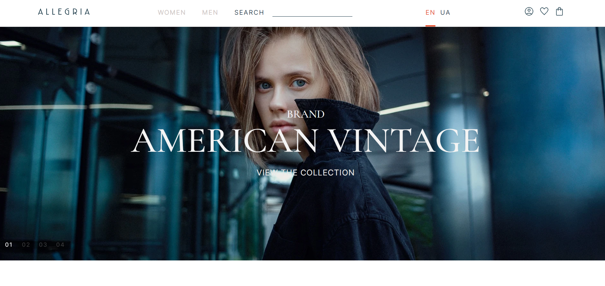
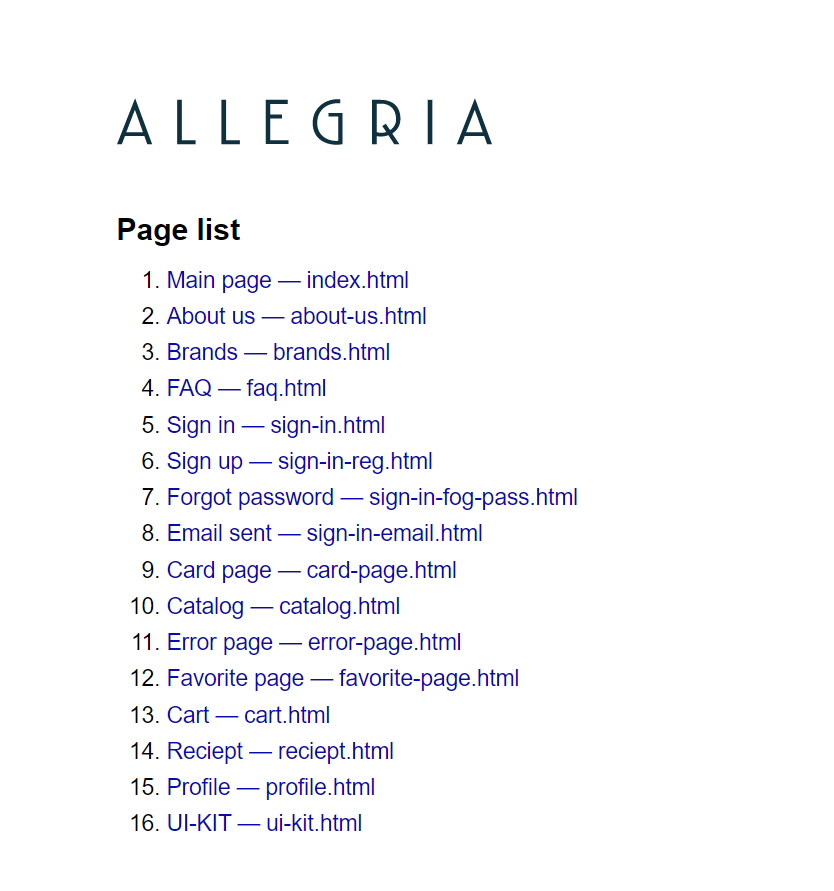
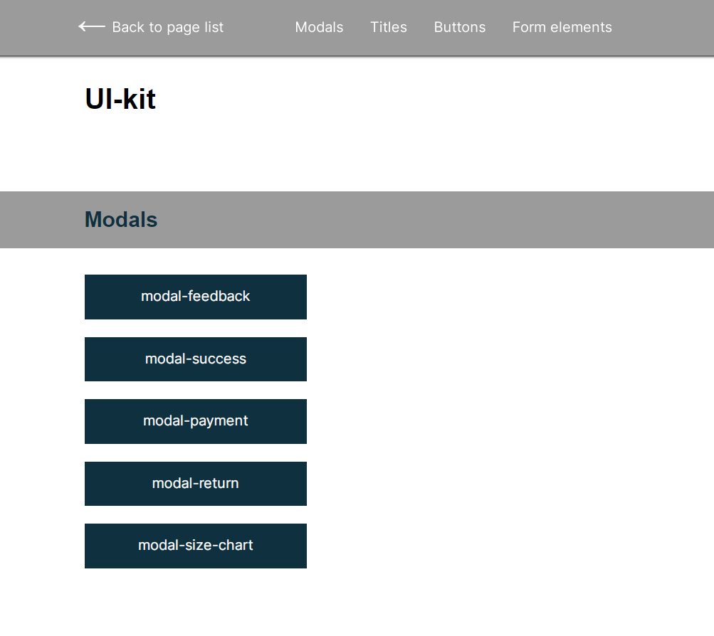
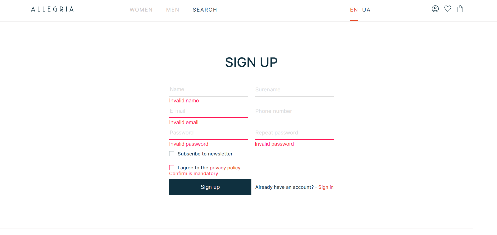
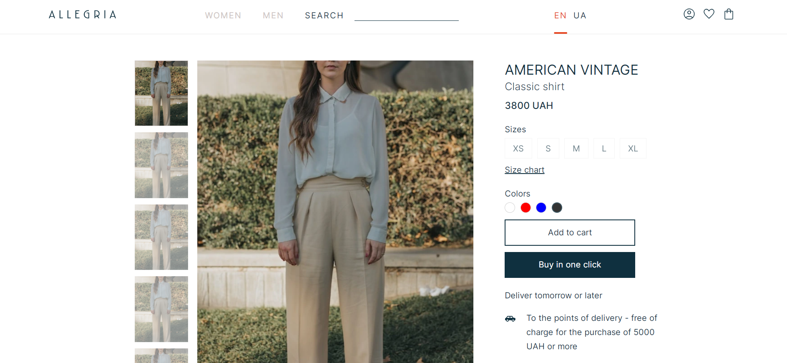
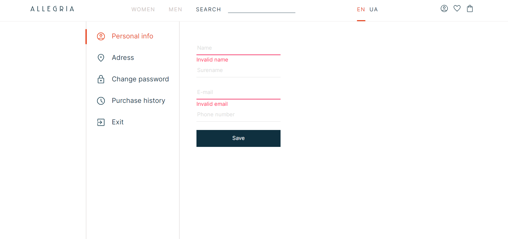

 

  <a href="https://lychakvlad.github.io/e-commerce-clothing-shop/" target='_blank'>
    

<h3 align="center">E-commerce website</h3>

  

    Multi-page e-commerce website for clothing
     
    <a href="https://github.com/LychakVlad/e-commerce-clothing-shop"><strong>Explore the code »</strong></a>
     
     
    <a href="https://lychakvlad.github.io/e-commerce-clothing-shop/">View Demo</a>
  

## About The Project

The site I created to showcase my skills and projects

### Built With

- JS
- PUG
- SASS
- GULP

## Preview some pages 

  <a href="https://lychakvlad.github.io/e-commerce-clothing-shop/sitemap.html" target='_blank'>
    

<h3 align="center">Sitemap page</h3>
     
     

  <a href="https://lychakvlad.github.io/e-commerce-clothing-shop/ui-kit.html" target='_blank'>
    

<h3 align="center">UI kit</h3>
     
     

  <a href="https://lychakvlad.github.io/e-commerce-clothing-shop/sign-in-reg.html" target='_blank'>
    

<h3 align="center">Registration form with validation</h3>
     
     

  <a href="https://lychakvlad.github.io/e-commerce-clothing-shop/card-page.html" target='_blank'>
    

<h3 align="center">Card page</h3>
     
     

  <a href="https://lychakvlad.github.io/e-commerce-clothing-shop/profile.html" target='_blank'>
    

<h3 align="center">An example of a tab on a profile page</h3>
     
     

  <a href="https://lychakvlad.github.io/e-commerce-clothing-shop/error-page.html" target='_blank'>
    

<h3 align="center">Error page example</h3>
     
     

## Contact

Vladislav Lychak - [@LinkedIn](https://www.linkedin.com/in/vladislav-lychak/) - lycakvladislav@gmail.com

Project Link: [https://lychakvlad.github.io/e-commerce-clothing-shop/](https://lychakvlad.github.io/e-commerce-clothing-shop/)

(<a href="#readme-top">back to top</a>)

